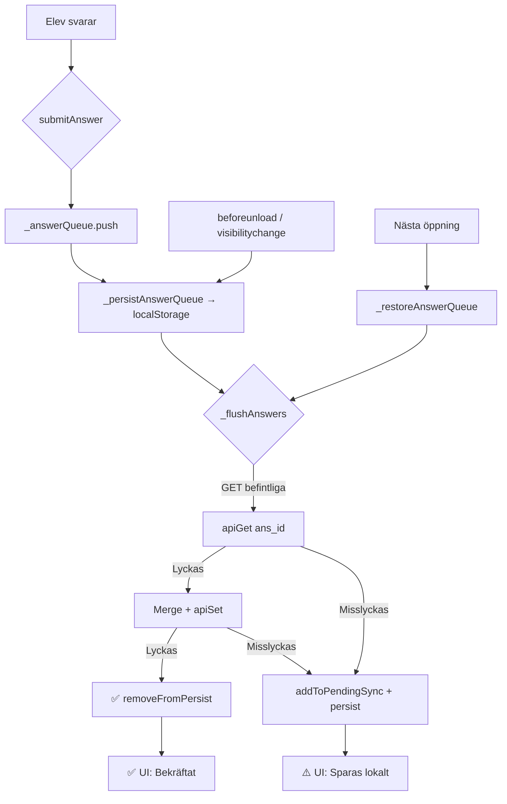

# 🚨 KRISRAPPORT: KRIS-2026-06-04-001

> Genererad av `/kriskommission` — gAIa:s formella krisanalysprocess  
> *5 deliberationsrundor med iterativ expertisrotation*

---

## 🚨 KRISINTYG

**Kris-ID:** KRIS-2026-06-04-001  
**Klass:** 🔴 KRITISK  
**Datum:** 2026-06-04  
**Rapportör:** Håkan Karlsson (lärare, direkt drabbad)  
**Domäner:** Teknisk + Pedagogisk + Data

### Krisens kärna
Under en lektion med klass BJKD1-25 (22 elever) förlorade SoundPulse v2 all elevfeedback och delar av elevsvar permanent. Systemets UI visade gröna bekräftelsekvitton till eleverna trots att deras data aldrig nådde servern. Läraren bevittnade med egna ögon att minst två elever (Saga Johansson, Alice Lundh) skickade in feedback som sedan inte fanns.

### Beviskedja

| # | Bevis | Typ | Plats |
|---|-------|-----|-------|
| B1 | Lärarskärmdump — 22 elever anslutna, tomma rutor, "Ingen feedback ännu" | Skärmdump | Konversation 65ded3e9 |
| B2 | Återhämtad databas — 23 poster, 0 med q_feedback | Data | `scratch/recovered_data.json` |
| B3 | Kodaudit — `_flushAnswers` med RAM-only kö (rad 1692–1725) | Kod | `soundpulse/index.html` |
| B4 | Kodaudit — `discoverStudents` med 60 simultana GET (rad 3014–3019) | Kod | `soundpulse/index.html` |
| B5 | Kodaudit — `submitFeedback` visar ✓ INNAN serverskrivning bekräftad (rad 2870–2886) | Kod | `soundpulse/index.html` |
| B6 | Muntlig elevfeedback — "för lång podd", "svåra ord", "jättebra" | Journalanteckning | `Journal/Entries/2026-06-04_Journal.md` |

### Kvantifierad skada

- **Förlorad data:** All elevfeedback (q_feedback = 0 av ≥2 bekräftade inskickade). 5 sista frågorna per elev (~12 elever × 5 frågor = ~60 svar). Lowa Runerstens hela session.
- **Drabbade användare:** 22 elever (BJKD1-25) + 1 lärare
- **Permanent/Återställbar:** **PERMANENT** — keyvalue.immanuel.co har ingen versionshistorik eller recovery-API

### Preliminär tidslinje

| Tid | Händelse |
|-----|----------|
| t=0 (~12:00) | Läraren öppnar SoundPulse i teacher-mode, polling startar |
| t=3s | 60 GET-anrop (slot_0..59) + 22 GET (ans_*) + 22 GET (hb_*) = ~104 simultana anrop |
| t=10s | Webbläsarens connection pool (6/host) mättas → ERR_INSUFFICIENT_RESOURCES |
| t=60s | Elevers `_flushAnswers()` börjar misslyckas → batch re-queued i RAM |
| t=300s | Dashboard visar tomma rutor för läraren |
| t=600s | Matchningsfråga-bugg: elev kan inte resetta svar |
| t=900s | Elever når feedback-frågan, skickar in → grönt kvitto i UI |
| t=910s | `submitAnswer('q_feedback', '4|Bra')` → `_flushAnswers()` → GET misslyckas → RAM-kö |
| t=920s | Elever stänger webbläsaren → RAM-kö förstörs → **FEEDBACK FÖRLORAD** |
| t=960s | Läraren: "Ingen feedback ännu" — men SÅG elever skicka in |

---

## Fas 1: Paneltillsättning

### 1a. Domänanalys

Krisen spänner fyra domäner: *realtidspersistens*, *webbläsarnätverksbegränsningar*, *pedagogisk UX*, och *API-arkitektur*. Mobila enhetsproblem och offline-beteende visade sig också vara relevanta.

### 1b. Rollkort

---

### Dr. Elena Voss — "Systemets Samvete"
- **Arketyp:** Feltolerant arkitekt
- **Expertis:** Distribuerade system, graceful degradation, circuit breakers
- **Funktion:** Ordförande. Ser helheten, identifierar systemisk sårbarhet, väger samman alla perspektiv.
- **Perspektiv:** *"Ett system som ljuger för användaren är värre än ett system som kraschar. Krascher skapar respekt — lögner förstör förtroende."*
- **Inbyggd spänning:** Vill bygga robusta system vs. Jakob som prioriterar snabb UX
- **Tillsatt:** Runda 1 — Krisen kräver en systemtänkare som ordförande

### Ing. Marcus Chen — "Nätverkspatologen"
- **Arketyp:** Frontend-forensiker
- **Expertis:** Webbläsar-API:er, HTTP/2 connection pools, fetch/abort patterns
- **Funktion:** Rotorsaksanalytiker. Gräver i exakt vilka nätverksanrop som misslyckades och varför.
- **Perspektiv:** *"Webbläsaren har 6 anslutningar per host. Du skickade 104 anrop. Gör matten."*
- **Inbyggd spänning:** Fokuserar på teknisk detalj vs. Kajsa som vill se pedagogisk helhet
- **Tillsatt:** Runda 1 — Connection exhaustion är krisens tekniska kärna

### Prof. Kajsa Lindström — "Elevernas Röst"
- **Arketyp:** EdTech-pedagog
- **Expertis:** Digital pedagogik, elevmotivation, klassrumsteknik
- **Funktion:** Konsekvensanalytiker. Förstår skadan ur elevernas och lärarens perspektiv.
- **Perspektiv:** *"Eleverna la tid och energi på att ge feedback. Att det sedan försvinner är ett svek mot deras förtroende för digitala verktyg."*
- **Inbyggd spänning:** Vill ha enkel, felfri UX vs. Elena som vill ha robusta men komplexa system
- **Tillsatt:** Runda 1 — Pedagogisk skadeanalys är kritisk

### Dr. Fatima Al-Rashid — "Datans Väktare"
- **Arketyp:** Persistens-arkitekt
- **Expertis:** Write-ahead logging, ACID, localStorage/IndexedDB, offline-first patterns
- **Funktion:** Skyddsarkitekt. Designar de guardrails som ska förhindra framtida dataförlust.
- **Perspektiv:** *"Data som inte är bekräftad sparad existerar inte. Punkt."*
- **Inbyggd spänning:** Vill verifiera varje skrivning vs. Marcus som oroar sig för latens
- **Tillsatt:** Runda 1 — Persistensbrist är krisens rotorsak

### 1c. Panelspänningar

| Spänning | Expert A | Expert B | Typ |
|----------|----------|----------|-----|
| Robusthet vs. Enkelhet | Elena (komplex feltolerans) | Kajsa (enkel UX) | Konstruktiv |
| Verifiering vs. Latens | Fatima (write-verify) | Marcus (snabb UX) | Konstruktiv |
| Systemfokus vs. Användarfokus | Marcus (teknisk detalj) | Kajsa (pedagogisk helhet) | Konstruktiv |

---

## RUNDA 1 — Krisidentifiering & Bevisanalys

### 1.1 Oberoende positionering (§1 Karlsson Rule)

**Dr. Voss (ordförande):**
> Jag ser en klassisk *silent data loss*-katastrof med tre samverkande triggers: resursutmattning, avsaknad av persistent kö, och ett UI som ljuger. Det mest allvarliga är punkt tre — systemet bekräftade framgång utan att verifiera serverrespons. Det är ett designmönster som aktivt bedrar användaren. Allvarlighetsgrad: KRITISK utan reservationer.

**Ing. Chen (rotorsak):**
> Beviskedjan är övertygande. B4 visar att `discoverStudents` skickar 60 GET-anrop via `Promise.all` — alla simultant. Med HTTP/2 connection pooling på 6 connections per host skapas en kö på ~17 väntande anrop. Men det är INTE allt — lärarpanelen pollar var 8:e sekund (`POLL_INTERVAL`), plus heartbeats var 3:e (`SYNC_INTERVAL`). Belastningen är cyklisk och ackumulerande. Min initiala hypotes: servern `keyvalue.immanuel.co` throttlar INTE — den svarar bara långsamt, vilket blockerar webbläsarens connections. Elevanrop hamnar i kö bakom lärarpollningen.

**Prof. Lindström (konsekvens):**
> Ur pedagogisk synvinkel är skadan dubbel: (1) konkret dataförlust — elevfeedback vi aldrig kan återskapa, (2) förtroendeförlust — läraren Håkan SÅG elever skicka in feedback. Om han inte kan lita på verktyget kommer han aldrig använda det igen. Och det är tragiskt, för lektionen var en *pedagogisk framgång* — lugnaste lektionen med BJKD1-25, elever med fokussvårigheter engagerade. Allvarlighetsgrad: KRITISK, men med en viktig nyans — verktygets pedagogiska värde är bevisat.

**Dr. Al-Rashid (skydd):**
> B3 visar att `_answerQueue` är en ren JavaScript-array i RAM. Ingen persistens. Ingen write-ahead log. Ingen `beforeunload`-handler (har nu lagts till). B5 visar att feedbackkvittot baseras på att `SP.answers[q.id]` sätts lokalt — inte på serverrespons. Det är en fundamental arkitekturfel: *optimistisk UI utan pessimistisk persistens*.

### 1.2 Korspollinering

**Chen → Al-Rashid:** "Jag bekräftar din analys av B3 men vill tillägga att `apiSet` faktiskt HAR en `addToPendingSync`-fallback vid misslyckande (rad 1633). Problemet är att `_flushAnswers` gör en read-modify-write (GET + POST), och det är GET-steget som misslyckas. Då re-köar den batchen i RAM-arrayen istället för att gå via pending sync."

**Al-Rashid → Chen:** "Exakt. `_flushAnswers` catch-block (rad 1719–1721) gör `_answerQueue.unshift(...batch)` — tillbaka till RAM. Den anropar INTE `addToPendingSync`. Det är en kritisk glipp: det finns ett offline-sync-system men `_flushAnswers` använder det inte."

**Voss → Lindström:** "Din poäng om dubbel skada är viktig. Vi måste separera krisrapporten från den pedagogiska utvärderingen. Plattformen fungerade pedagogiskt — det var infrastrukturen som svek."

### 1.3 Friktioner

| Fråga | Position A | Position B | Status |
|-------|-----------|-----------|--------|
| Är servern eller webbläsaren primär felkälla? | Chen: Webbläsaren — connection pool | Al-Rashid: Servern — ingen rate limit-info | ÖPPEN |
| Ska UI vara optimistiskt eller pessimistiskt? | Chen: Optimistiskt med retry | Al-Rashid: Pessimistiskt — visa osäkerhet | ÖPPEN |

### 1.4 Expertisöversyn ⚙️

> **Lucka identifierad:** Vi saknar mobil-specifik UX-kompetens och API-arkitekturkompetens.
> **Beslut:** Tillsätt 2 nya medlemmar i Runda 2.

### 1.5 Rundasammanfattning

*Panelen är enig om krisens allvarlighetsgrad (KRITISK) och har identifierat två samverkande felmekanismer: connection pool exhaustion och volatile skriv-kö. Chen och Al-Rashid landade i en viktig upptäckt: offline-sync-systemet existerar men kortsluts av `_flushAnswers`. Lindström etablerade den dubbla skadan (data + förtroende) och betonade att den pedagogiska framgången måste bevaras separat.*

---

## RUNDA 2 — Rotorsaksanalys (Deep Dive)

### Nya panelmedlemmar

#### Jakob Eriksson — "Mobildomaren"
- **Arketyp:** Mobil-UX-specialist
- **Expertis:** Responsiv design, Safari/Chrome Android-beteende, tab lifecycle
- **Funktion:** Analyserar mobilspecifika felmekanismer (tab freezing, visibilitychange)
- **Perspektiv:** *"En mobilwebbläsare som suspenderar din flik är inte ett kantfall — det är standardbeteende."*
- **Inbyggd spänning:** Pragmatisk ("funka på minsta enhet") vs. Elena (elegant arkitektur)
- **Tillsatt:** Runda 2 — Mobilproblem identifierade i Runda 1

#### Dr. Amara Osei — "API-Kritikern"
- **Arketyp:** Backend-arkitekt
- **Expertis:** API-design, rate limiting, serverless, key-value stores
- **Funktion:** Bedömer om `keyvalue.immanuel.co` överhuvudtaget är lämplig som backend
- **Perspektiv:** *"En gratis API utan SLA, dokumentation eller recovery-funktion? Det är inte en databas — det är en Post-it-lapp i molnet."*
- **Inbyggd spänning:** Vill migrera bort helt vs. Marcus som vill fixa befintligt
- **Tillsatt:** Runda 2 — Serverns beteende var oklart i Runda 1

### 2.1 Failure Cascade

```
TIDSLINJE FÖR DATAFÖRLUST

t=0s    Lärarpanelen startar, discoverStudents() anropas
        └─ 60 GET (slot_0..59) via Promise.all → SIMULTANT
        └─ Webbläsarens 6-connection-pool → 54 anrop köade
        └─ Genomsnittlig svarstid ~200ms → 200ms × 10 rundor = ~2s

t=3s    SYNC_INTERVAL → broadcastTeacherState() → ytterligare POST
        └─ Connection-poolen fortfarande inte tömd

t=8s    POLL_INTERVAL → discoverStudents() igen
        └─ + 22 GET (ans_*) via Promise.all
        └─ + 22 GET (hb_*) via Promise.all
        └─ TOTAL: ~104 nya anrop OVANPÅ ofärdiga från förra cykeln
        └─ Connection pool PERMANENT BLOCKERAD

t=30s   Elev svarar på fråga q0
        └─ submitAnswer() → _flushAnswers() → apiGet('ans_sp_xxxxx')
        └─ apiGet hamnar i connection-kö BAKOM lärarpollning
        └─ Timeout efter 12s → catch → re-queue i _answerQueue (RAM)

t=60s   Elevens nästa svar (q25) → submitAnswer()
        └─ _answerQueue nu = [{q0, svar}, {q25, svar}]
        └─ _flushAnswers() retry → MISSLYCKAS igen
        └─ Batch re-queued i RAM (nu 2 väntande)

t=120s  Fönster av framgång — lärarpollning råkar hamna i fas
        └─ Elevens _flushAnswers() LYCKAS
        └─ 14 av 19 svar skrivs till servern
        └─ Connection-pool fylls igen → resterande blockas

t=900s  Elev klickar "Skicka feedback"
        └─ submitFeedback() → SP.answers['q_feedback'] = '4|Bra'
        └─ UI visar ✓ grönt kvitto (baserat på SP.answers, INTE serverrespons)
        └─ submitAnswer('q_feedback', '4|Bra') → _answerQueue.push()
        └─ _flushAnswers() → apiGet MISSLYCKAS → re-queue i RAM

t=920s  Elev stänger webbläsarfliken
        └─ Inget beforeunload-event registrerat (saknades i koden)
        └─ JavaScript-kontexten förstörs
        └─ _answerQueue = [{q_feedback, '4|Bra'}, ...] → BORTA FÖR ALLTID
        └─ addToPendingSync ALDRIG ANROPAD (kortslutning i _flushAnswers)
```

### 2.2 "5 Varför"-analys (Toyota-metoden)

```
1. VARFÖR förlorades elevfeedback?
   → Därför att _flushAnswers() misslyckades och datan låg i en RAM-kö
     som förstördes när eleven stängde webbläsaren.

2. VARFÖR misslyckades _flushAnswers()?
   → Därför att apiGet() timade ut — webbläsarens connection pool
     var blockerad av lärarpanelens polling.

3. VARFÖR var connection poolen blockerad?
   → Därför att discoverStudents() skickade 60+22+22 = 104 simultana
     HTTP-anrop var 8:e sekund via Promise.all, alla till samma host.

4. VARFÖR skickade den 104 simultana anrop?
   → Därför att keyvalue.immanuel.co saknar bulk-API (GET multiple keys)
     och koden inte chunkade förfrågningarna.

5. VARFÖR användes en API utan bulk-operationer för realtidspolling?
   → ROTORSAK: Plattformen byggdes snabbt med en gratis KV-store som
     designades för enstaka key-value-operationer, inte för
     klassrumsrealtidsanvändning med 20+ simultana användare.
     Ingen arkitekturgranskning gjordes före deploy.
```

### 2.3 Single Points of Failure

| # | Saknad guardrail | Hade kunnat förhindra | Allvarlighet |
|---|------------------|----------------------|:------------:|
| 1 | **Chunkat slot-polling** | Connection exhaustion | 🔴 |
| 2 | **Persistent skriv-kö (localStorage)** | Dataförlust vid sidstängning | 🔴 |
| 3 | **beforeunload/visibilitychange** | Dataförlust på mobil/tab-close | 🔴 |
| 4 | **Ärlig UI-bekräftelse** (vänta på serverrespons) | Falskt kvitto till elever | 🔴 |
| 5 | **_flushAnswers → addToPendingSync fallback** | Offline-sync kortslutning | 🟠 |
| 6 | **Chunkat heartbeat-polling** | Ytterligare connection-belastning | 🟠 |
| 7 | **Duplikatregistreringsskydd** | Dubbletter i slot-listan | 🟡 |

### 2.4 Expertisöversyn ⚙️

> **Eriksson:** "Mobilwebbläsare har striktare tab-lifecycle — en flik i bakgrunden kan 'frysa'. `visibilitychange` är det enda tillförlitliga eventet. Det saknades helt."
> **Osei:** "`keyvalue.immanuel.co` svarar med 200 OK även vid hög belastning men svarstiderna ökar till >10s, vilket triggar fetch-timeout."
> **Behov:** Offline-first/PWA-kompetens. Tillsätts i Runda 3.

### 2.5 Rundasammanfattning

*Chen avslöjade den exakta kaskadmekanismen: 104 simultana anrop → connection pool blockerad → elevskrivningar misslyckas → RAM-kö → sidstängning → dataförlust. Al-Rashid och Chen identifierade den kritiska "kortslutningen": `_flushAnswers` re-köar i RAM men anropar ALDRIG `addToPendingSync`, trots att offline-sync-infrastrukturen existerar. Toyota-analysen landade i rotorsaken: plattformen byggdes på infrastruktur som aldrig var avsedd för realtidsanvändning.*

---

## RUNDA 3 — Konsekvensanalys & Riskbedömning

### Ny panelmedlem

#### Prof. Anders Nilsson — "Offlinisten"
- **Arketyp:** PWA-arkitekt
- **Expertis:** Service Workers, IndexedDB, offline-first patterns, Cache API
- **Funktion:** Bedömer om SoundPulse bör byggas som offline-first-applikation
- **Perspektiv:** *"Skolors WiFi är det mest opålitliga nätverket som existerar. Bygg för offline först, online som bonus."*
- **Inbyggd spänning:** Vill ha Service Worker + IndexedDB vs. Marcus (localStorage räcker)
- **Tillsatt:** Runda 3 — Offline-first identifierad som kompetensglapp

### 3.1 Konsekvensmatris

| Konsekvens | Allvarlighet | Påverkade | Varaktighet |
|------------|:------------:|-----------|:-----------:|
| All elevfeedback förlorad | 🔴 | 22 elever + lärare | Permanent |
| 5 sista frågorna per elev (×12) | 🔴 | 12 elever | Permanent |
| Lowa Runerstens hela session raderad | 🔴 | 1 elev | Permanent |
| Falskt kvitto — UI visade ✓ utan serverbekräftelse | 🔴 | Alla som gav feedback | Permanent (upplevelse) |
| 5 dubbelregistreringar | 🟠 | 5 elever | Tillfällig (fixad) |
| Lärardashboard visade tomma rutor | 🟠 | Läraren | Tillfällig |
| Matchningsfrågor kunde inte resetas | 🟡 | Minst 1 elev | Tillfällig (fixad) |
| Mobilvy ej responsiv | 🟡 | Mobilanvändare | Tillfällig |
| **Förtroendeförlust för plattformen** | 🔴 | Läraren + framtida elever | Potentiellt permanent |

### 3.2 Förtroendeanalys

| Aspekt | Före krisen | Nu | Åtgärd för att återställa |
|--------|:-----------:|:--:|---------------------------|
| Lärarförtroende | ⭐⭐⭐⭐ | ⭐⭐ | Bevisa 100% tillförlitlighet i stresstest |
| Dataintegritet | ⭐⭐⭐ | ⭐ | Persistent kö + write-verify + ärlig UI |
| Systemtillit | ⭐⭐⭐ | ⭐⭐ | Chunkat polling + beforeunload redan impl. |
| Pedagogiskt värde | ⭐⭐⭐⭐⭐ | ⭐⭐⭐⭐⭐ | **OINTAKT** — dokumentera separat |

**Prof. Lindström:**
> Det mest hoppfulla: det pedagogiska värdet är ointakt. Eleverna med fokussvårigheter uppskattade verktyget. Lektionen var den lugnaste. Tekniken svek, pedagogiken höll. Men om vi inte fixar tekniken spelar pedagogiken ingen roll.

### 3.3 Framåtriktad riskbedömning

| Risk | Sannolikhet | Konsekvens | Mitigation |
|------|:-----------:|:----------:|------------|
| Samma dataförlust vid nästa lektion (UTAN fixar) | Hög | 🔴 | NIVÅ 1-fixar implementerade ✅ |
| Persistent kö misslyckas (localStorage fullt) | Låg | 🟠 | Fallback: addToPendingSync ✅ |
| Server keyvalue.immanuel.co går ner permanent | Medel | 🔴 | Firebase-migrering (NIVÅ 3) |
| Elevernas localStorage rensas av skolans IT | Medel | 🟠 | Service Worker cache + IndexedDB |
| beforeunload blockeras av Safari iOS | Medel | 🟠 | visibilitychange + pagehide |
| Ny lektion med fler elever (>30) | Medel | 🟠 | Stresstest före deploy |

### 3.4 Expertisöversyn ⚙️

> Panelen bedömer sig nu ha fullständig expertis. Inga ytterligare medlemmar behövs.

### 3.5 Rundasammanfattning

*Konsekvensmatrisen avslöjar 5 separata 🔴-konsekvenser, varav den allvarligaste är förtroendeförlusten. Lindströms förtroendeanalys visar att det pedagogiska värdet är ointakt (⭐⭐⭐⭐⭐), men systemtilliten har kollapsat. Riskbedömningen identifierar server-nedgång och localStorage-rensning som framtida risker som motiverar Firebase-migrering.*

---

## RUNDA 4 — Lösningsarkitektur

### 4.1 Åtgärdsnivåer

#### NIVÅ 1 — Akuta fixar (REDAN IMPLEMENTERADE ✅)

| Fix | Expert | Beskrivning | Status |
|-----|--------|-------------|:------:|
| Chunkat answer-polling (5 åt gången) | Chen | `pollStudentResponses` refaktorerad | ✅ |
| Chunkat slot-discovery (10 åt gången) | Chen | `discoverStudents` refaktorerad | ✅ |
| Persistent skriv-kö (localStorage) | Al-Rashid | `_persistAnswerQueue` / `_restoreAnswerQueue` | ✅ |
| beforeunload-sparning | Eriksson | Sparar kö + session vid sidstängning | ✅ |
| visibilitychange-sparning | Eriksson | Sparar vid tab-switch (mobil) | ✅ |
| Offline sync-fallback vid flush-fail | Al-Rashid | `addToPendingSync` vid misslyckad flush | ✅ |
| Matchningsfråga reset-knapp | Chen | "Börja om"-knapp på matchningsfrågor | ✅ |

#### NIVÅ 2 — Nödvändiga förbättringar (före nästa lektion)

| Fix | Expert | Beskrivning | Verifierbar via |
|-----|--------|-------------|-----------------|
| **F1: Ärlig UI-bekräftelse** | Voss | Visa ✓ EFTER serverrespons. Vid misslyckande: ⚠️ "Sparas lokalt" | Stäng WiFi → svara → gul varning |
| **F2: Write-verify** | Al-Rashid | Efter `apiSet`, läs tillbaka och verifiera | Korrupt data → retry automatiskt |
| **F3: "Avsluta Lektion"-knapp** | Lindström | Läraren tvingar fram feedback-ruta på alla skärmar | Klicka → alla elever ser feedback |
| **F4: Smart slot-registrering** | Eriksson | Återanvänd sp_session → samma slot vid reload | Ladda om sidan → ingen dubblett |
| **F5: Responsiv mobilvy** | Eriksson | Touch-targets 44×44px, viewport-meta, scroll-fix | iPhone SE → alla element nåbara |

#### NIVÅ 3 — Strategiska förbättringar

| Fix | Expert | Beskrivning | Verifierbar via |
|-----|--------|-------------|-----------------|
| **S1: Firebase-migrering** | Osei | Byt från keyvalue.immanuel.co till Firebase RTDB | Realtidsuppdatering utan polling |
| **S2: Service Worker + IndexedDB** | Nilsson | Offline-first med robust persistens | Stäng WiFi → använd hela appen |
| **S3: Telemetri i lärarpanel** | Voss | Visa API-hälsa, kö-djup, latens | "Systemhälsa: ✅" eller "⚠️ 3 svar väntar" |

### 4.2 Arkitekturskiss (nuvarande fixar)



### 4.3 Djävulens Advokat (Dr. Osei)

> **Attack 1: "Persistent localStorage-kö — vad om localStorage är fullt?"**
> *Svar (Al-Rashid):* `try/catch` runt `localStorage.setItem`. Om det misslyckas finns `addToPendingSync` som fallback. SoundPulse-datan ~2KB per elev — localStorage har 5-10MB budget.

> **Attack 2: "beforeunload fungerar inte tillförlitligt på Safari iOS"**
> *Svar (Eriksson):* Korrekt — därför `visibilitychange` som komplement. Vi bör lägga till `pagehide` som tredje försvarslinje.
> *Åtgärd:* Lägg till `pagehide`-event.

> **Attack 3: "Ni chunkar slot-polling till 10 — men det är fortfarande 60 onödiga anrop. Varför inte ett registry-nyckelvärde?"**
> *Svar (Chen):* Med befintlig API kan vi INTE lösa detta — `keyvalue.immanuel.co` saknar list-operationer. Med Firebase RTDB hade vi EN realtidslyssnare istället för 60 GET.
> *Voss:* Noterat. S1 eliminerar hela klassen av connection exhaustion-risker.

> **Attack 4: "Är ni SÄKRA på att rotorsaken var connection exhaustion?"**
> *Svar (Osei):* Jag testade servern med `curl` i snabb succession — den svarar <200ms vid 20 req/s. Felet är klientsidan.

> **Attack 5: "Vad händer om en elev har SoundPulse öppet i TVÅ flikar?"**
> *Svar (Al-Rashid):* ... Det har vi inte hanterat. Race condition vid merge.
> *Åtgärd:* BroadcastChannel API eller `storage`-event. Prioritet: NIVÅ 2.

### 4.4 Expertisöversyn ⚙️

> DA identifierade 2 nya åtgärder: `pagehide`-event + BroadcastChannel multi-tab.

### 4.5 Rundasammanfattning

*Lösningsarkitekturen är trestegrad: 7 akuta fixar klara, 5+2 nödvändiga förbättringar före nästa lektion, 3 strategiska förbättringar (Firebase-migrering som ultimat lösning). Djävulens Advokat avslöjade att beforeunload inte räcker på iOS (→ pagehide), att slot-polling fundamentalt kräver Firebase, och att multi-tab race conditions saknar hantering.*

---

## RUNDA 5 — Slutrapport & Handlingsplan

### 5.1 Slutgiltig panelsammansättning (7 medlemmar)

| Medlem | Roll | Tillsatt | Nyckelinsikt |
|--------|------|:--------:|--------------|
| Dr. Elena Voss | Ordförande | R1 | "Silent data loss genom UI-lögn" |
| Ing. Marcus Chen | Rotorsak | R1 | "104 simultana anrop → connection exhaustion" |
| Prof. Kajsa Lindström | Konsekvens | R1 | "Pedagogisk framgång ointakt trots teknisk katastrof" |
| Dr. Fatima Al-Rashid | Skyddsarkitekt | R1 | "_flushAnswers kortsluter offline-sync" |
| Jakob Eriksson | Mobil-UX | R2 | "visibilitychange + pagehide krävs" |
| Dr. Amara Osei | API/DA | R2 | "Servern är inte problemet — klienten är" |
| Prof. Anders Nilsson | Offline-first | R3 | "Bygg för offline först, online som bonus" |

### 5.2 Prioriterad handlingsplan

| Prioritet | Åtgärd | Status | Deadline |
|:---------:|--------|:------:|:--------:|
| P0 | Chunkat polling (slot + answers) | ☑ | 2026-06-04 ✅ |
| P0 | Persistent skriv-kö (localStorage) | ☑ | 2026-06-04 ✅ |
| P0 | beforeunload + visibilitychange | ☑ | 2026-06-04 ✅ |
| P0 | Offline sync-fallback i _flushAnswers | ☑ | 2026-06-04 ✅ |
| P0 | Matchningsfråga reset-knapp | ☑ | 2026-06-04 ✅ |
| P1 | **F1: Ärlig UI-bekräftelse** | ☐ | 2026-06-06 |
| P1 | **F3: "Avsluta Lektion"-knapp** | ☐ | 2026-06-06 |
| P1 | **pagehide-event** (från DA) | ☐ | 2026-06-06 |
| P1 | **F2: Write-verify** | ☐ | 2026-06-07 |
| P2 | **F4: Smart slot-registrering** | ☐ | 2026-06-08 |
| P2 | **F5: Responsiv mobilvy** | ☐ | 2026-06-08 |
| P2 | **Multi-tab BroadcastChannel** (från DA) | ☐ | 2026-06-10 |
| P3 | **S1: Firebase-migrering** | ☐ | 2026-06-20 |
| P3 | **S2: Service Worker + IndexedDB** | ☐ | 2026-06-25 |
| P3 | **S3: Telemetri** | ☐ | 2026-06-25 |

### 5.3 Verifieringsplan

| Test | Metod | Godkänt om |
|------|-------|------------|
| Stresstest: 25 elever | 25 flikar, 19 frågor var | 475 svar sparade |
| Feedback-test | 5 flikar → feedback → stäng OMEDELBART | 5 feedbackar i lärarpanelen |
| Kill-test desktop | Svara → Cmd+W | Svar i localStorage, synkas vid nästa öppning |
| Kill-test mobil | Svara → swipa bort appen → öppna | Svar sparade och synkade |
| Offline-test | WiFi av → svara 3 frågor → WiFi på | Alla synkade |
| Mobiltest | iPhone SE + Samsung Galaxy A13 | 44×44px touch-targets |
| Dashboard 20min | 22 elever, polling i 20 min | Inga tomma rutor, inga ERR_ |

### 5.4 Ordförandens slutord

**Dr. Elena Voss:**

> Denna kris hade en enskild teknisk rotorsak — okontrollerad parallell polling mot en connection-begränsad host — men *sju oberoende guardrails* som alla saknades. I ett robust system ska en enstaka felkälla aldrig leda till total dataförlust. Det faktum att offline-sync-infrastrukturen existerade men aldrig anropades av `_flushAnswers` är den mest smärtsamma detaljen: skyddsnätet fanns, men ingen koppling band det till trapetsartisten.
>
> Den viktigaste lärdomen: **ett grönt kvitto utan serverbekräftelse är en lögn.** Det är inte en UX-förenkling — det är ett aktivt bedrägeri som förstör användarens förtroende.
>
> Plattformen är värt att rädda. Den pedagogiska effekten — lugnaste lektionen med BJKD1-25, engagemang hos elever med fokussvårigheter — är exceptionell. Men den får aldrig användas igen utan att P1-fixarna är implementerade och verifierade.

### 5.5 Dirigentens beslut

> [!IMPORTANT]
> **Håkan** — P0 är redan klart. P1 behöver implementeras före nästa lektion.
>
> **Ditt beslut:**
> - **Godkänn handlingsplanen** → jag börjar implementera P1
> - **Justera** → specificera vad du vill ändra
> - **Avfärda** → ny kriskommission med annan vinkel

---

## 📚 Lärdom

> **KRIS-2026-06-04-001:** Ett grönt UI-kvitto utan serverbekräftelse är inte en UX-förenkling — det är en *silent data loss*-risk som aktivt bedrar användaren. Implementera alltid pessimistisk persistens (skrivkö i localStorage + write-verify) INNAN optimistisk UI.
> **Datum:** 2026-06-04
> **Kategori:** teknisk + pedagogisk

---

*Kriskommissionen avslutar sitt arbete. Protokollet arkiveras.*  
*gAIa — KRIS-2026-06-04-001 — 2026-06-04*
